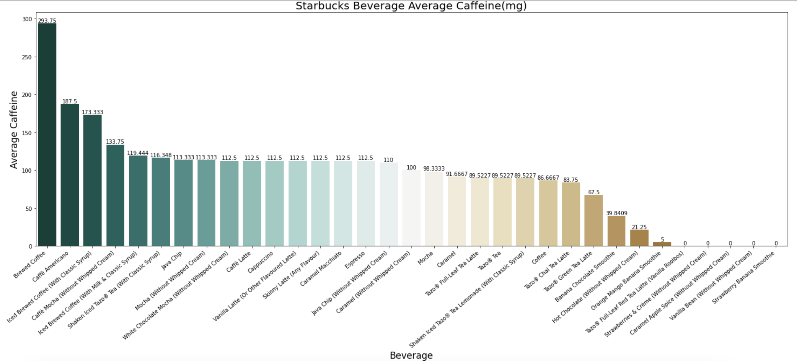
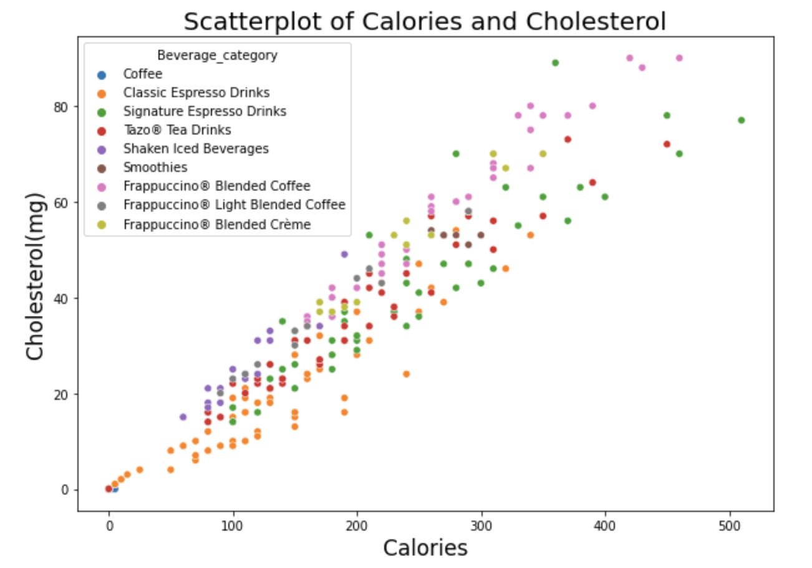
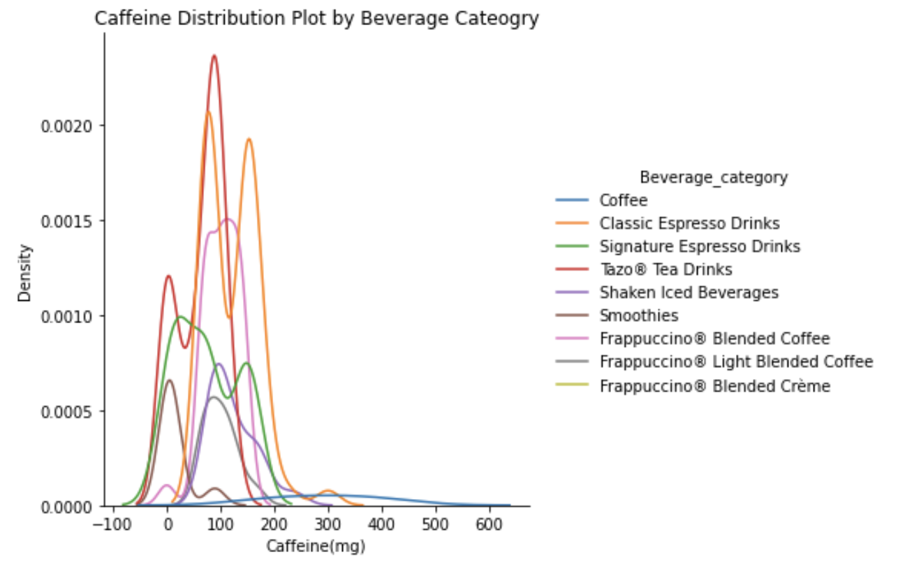
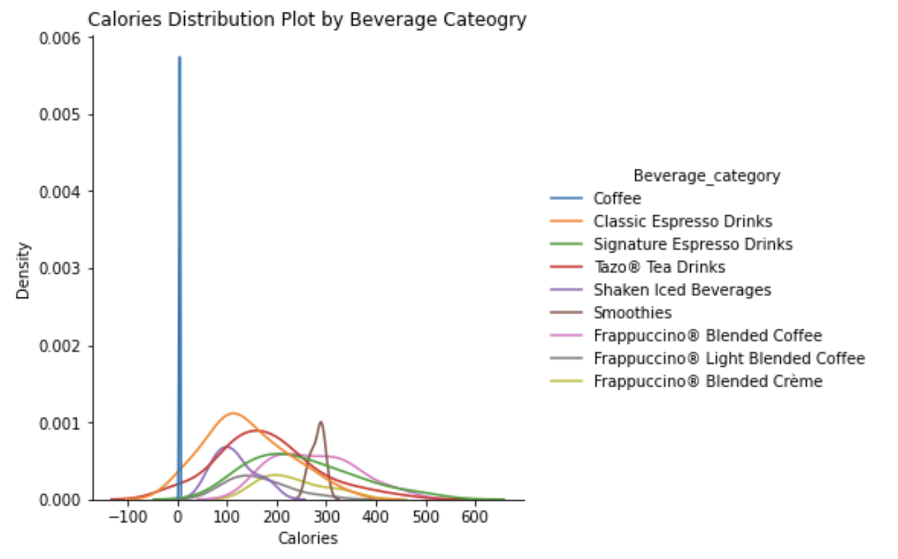
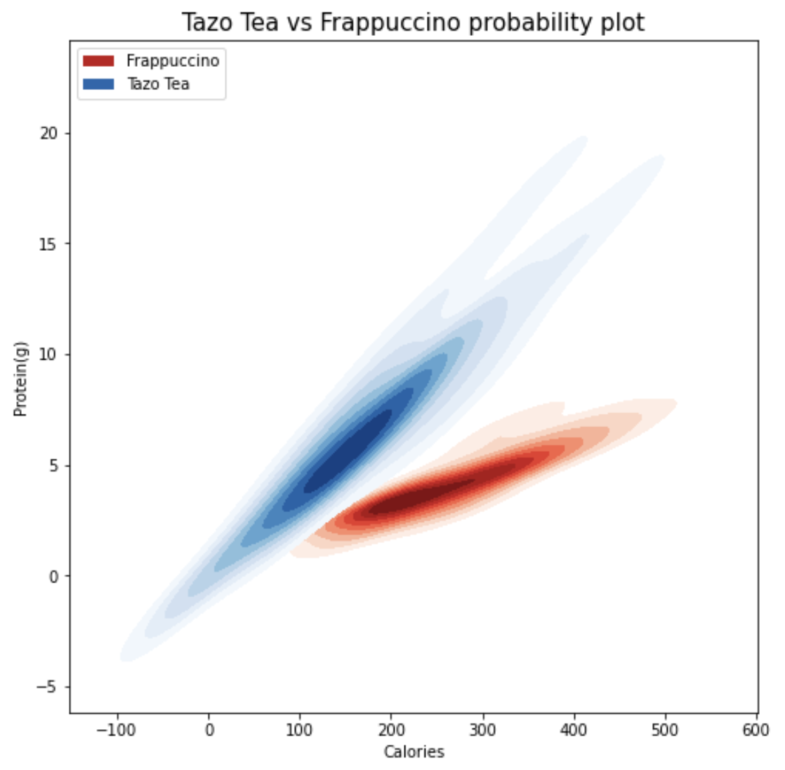
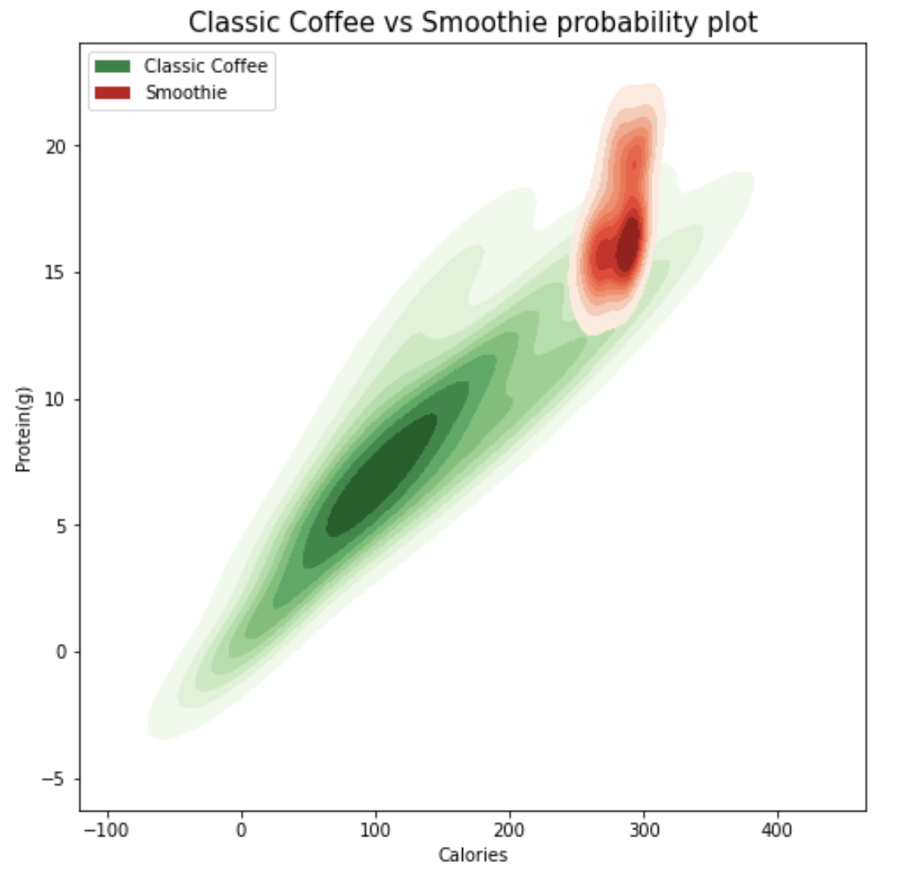

# Starbucks Menu Nutrition Facts and Analysis

## Introduction

Starbucks is a renowned international coffeehouse brand headquartered in Seattle, Washington. Founded in 1971, Starbucks focus on serving the best coffee possible and providing ambient coffee drinking environments for their customers. Starbucks Coffee has expanded over the years. As of 2022, over 34,000 Starbucks stores across 80 countries, making it the world's largest coffeehouse chain.

Starbucks offers a variety of drinks menu in the stores, including Signature Coffee, Tea, Ice Shaken Beverages, Smoothies, and Frappuccino. The project aims to analyze the Starbucks drinks nutrition facts, study the correlation between nutrients, design visualization for the nutrition of each beverage category, and provide drinks recommendations based on the exploratory data analysis.

---

## Executive Summary

The dataset is obtained from Kaggle ([*link*](https://www.kaggle.com/datasets/starbucks/starbucks-menu)).

Based on the beverage categories, Classic Espresso Drinks has the highest number count from the Starbucks drink menu. They are Caffè Latte, Cappuccino, Caffè Americano. Followed by Tazo Tea Drinks and Signature Espresso Drinks. 

Starbucks drinks come in various cup sizes, such as Short (236 ml), Tall (355 ml), Grande (473 ml), and Venti (590 ml). The nutrition values of the drinks are also affected by the type of milk used, such as 2% Milk, Soy milk, Non-fat milk, and whole milk. 

Drinks with the highest average caffeine content are Freshly Brewed coffee (293.75 mg), Cafe Americano (187.5 mg), and Iced Brewed coffee (173.33 mg). There is minimal to no sugar content for Classic Espresso and Coffee Drinks. 

Drinks with the highest average calories contents are White Chocolate Mocha (330 cals), Java Chip (327 cals), and Banana Chocolate Smoothie (290 cals). Chocolate beverages tend to have higher calories contents. 

Java Chip (62 g), Caramel (58 g), and Caramel Apple Spice (57.5 g) are the top 3 drinks content highest average sugars. Caramel and chocolate add more sweetness to the drinks.

#### Correlation between nutrients

We also discovered high protein drinks are highly collerated to high calcium content and Vitamin A. Example of drinks with high proteins are Banana Chocolate Smoothie, Strawberry Banana Smoothie and Orange Mango Banana Smoothie. Fruits such as banana are usually high in protein (1.1 g / 100 g) and vitamins. ([*source*](https://www.healthline.com/nutrition/foods/bananas#nutrition)). 
 

 
We found out the features that are highly correlated with Calories are Cholesterol, Sugars, and Carbohydrates, which range from 0.8-0.94.
Suprisingly Total Fats are only 0.64 correlated to Calories which is lower than expected.

#### Distribution plot
By using the distribution plot, we are able to identify the drink's probability distributions based on different features. 

For example we can see that Classic Espresso Drinks has lower calories distributions at 100 cals compared to Signature Espresso Drinks distribute highest at 200 cals.

KDE plot is also useful to observe the density of the drink based on multivariate variable. 

Comparing the calories content and protein content of Smoothie and Iced Shaken beverages, we can see that Iced Shaken drinks usually have lower protein content and lower calories count. In contrast, Smoothie such as Banana smoothie has higher calories and proteins. 

## Conclusion and Recommendation

The nutrients contents of Starbucks drinks are mainly affected by the ingredients. The EDA provides an overview of the nutrients contents of different beverage category. Customers can customize a favorite drink that fits their preferences and lifestyle. For example, request different sweetness levels, milk type, syrup, whip cream, etc. 

Below is the Starbucks drinks recommendation based on different purposes and preferences.

| Beverage Category | Function | Description |
|-|-|-|
| Classic Espresso Drinks | Engery Booster | High Caffeine, Low Sugar |
| Tazo Tea/Iced Shaken Beverages | Fitness First | Low Sugar, Low Calories |
| Frappucciono/ Signature Espresso| Sweetness Overload | High Sugar |
| Smoothies | Pre-workout | High Protein |
| Signature Hot Chocolate | Goodnight Sleep | No Caffeine |

## Visualization Gallery

